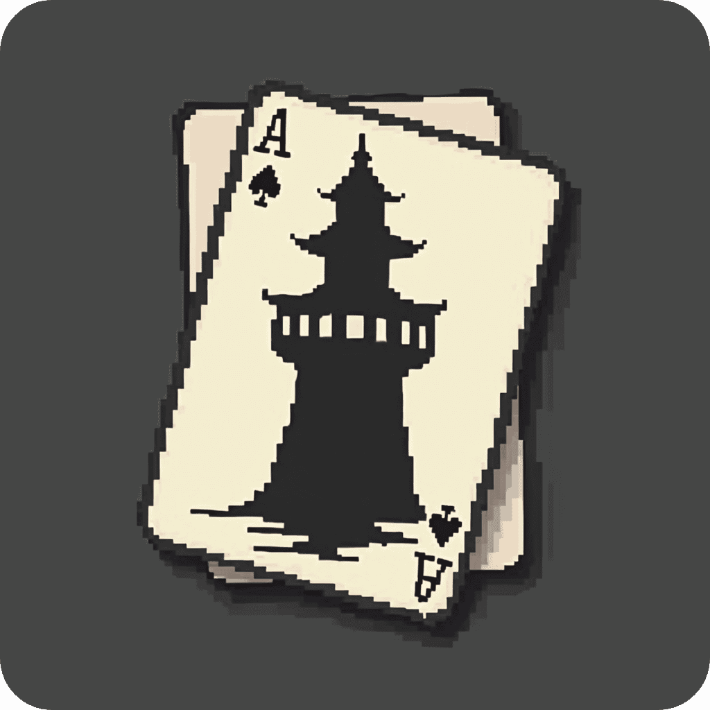
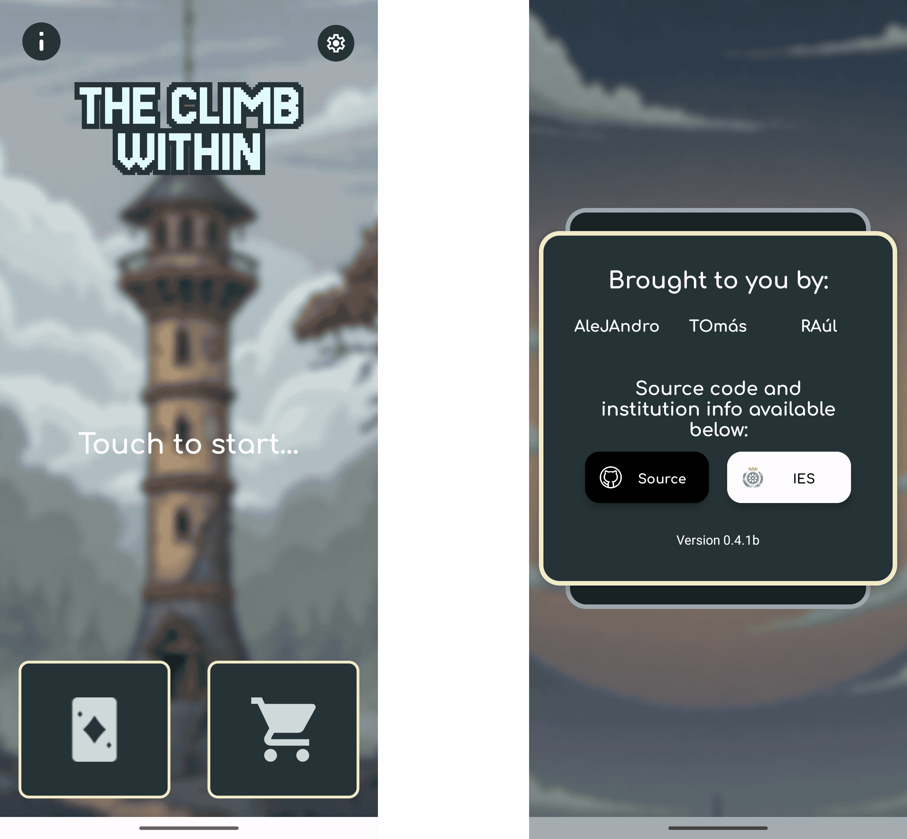
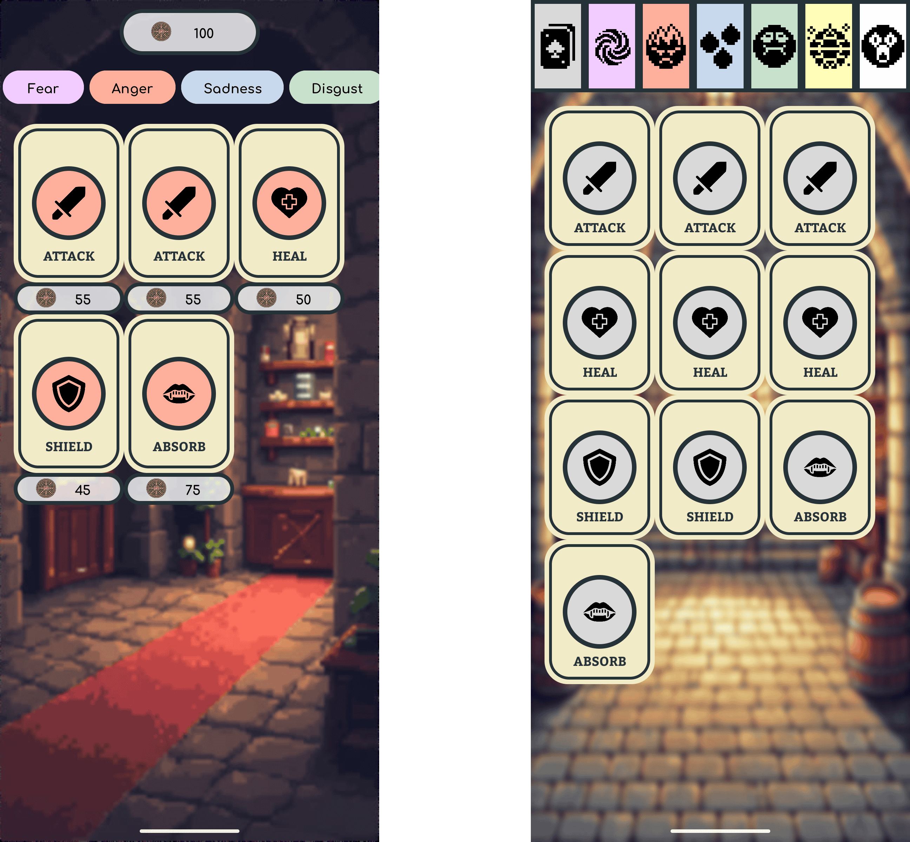
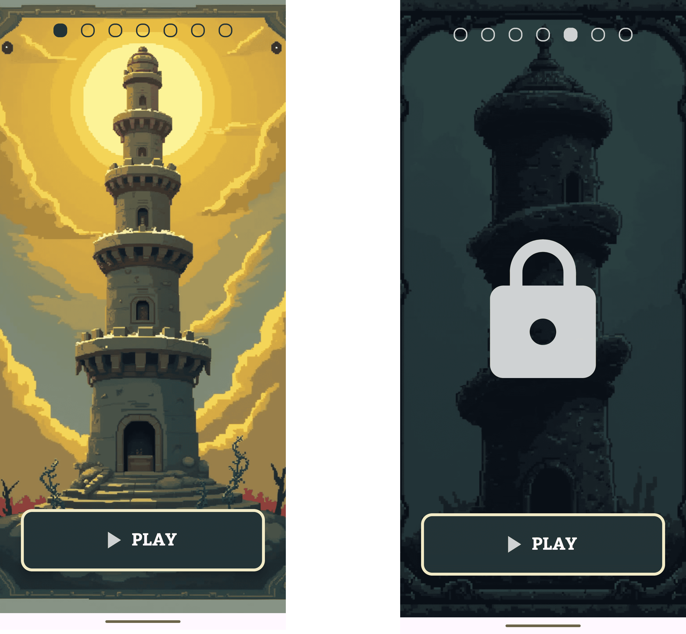
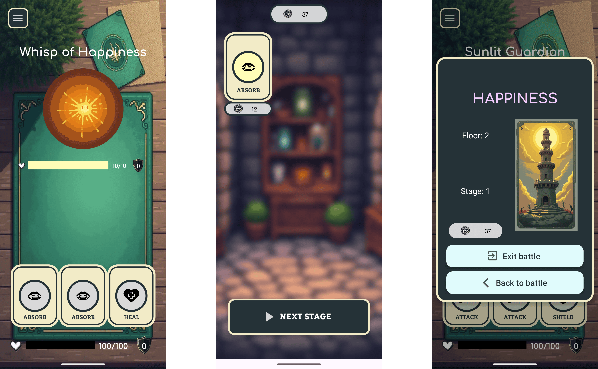
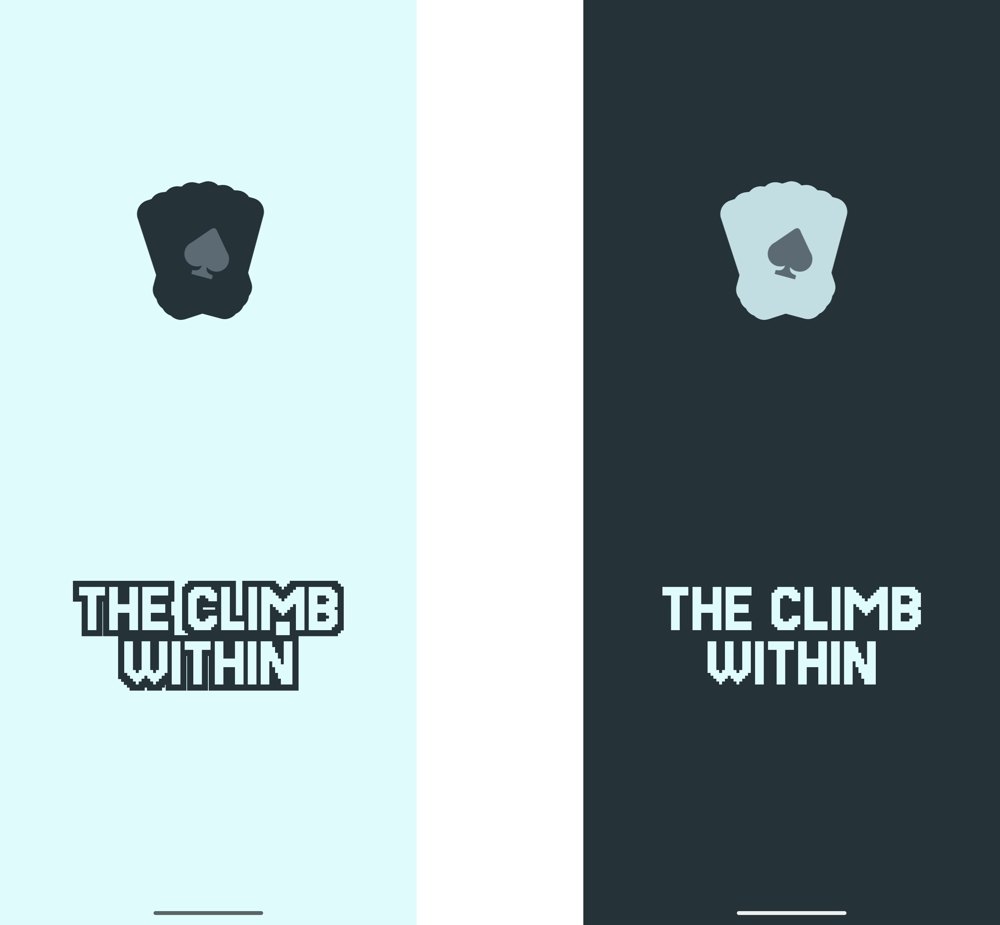

# The Climb Within
<p align="center">
  
  <!--  OLD IMAGE -->
  <!--  -->
</p>

Step into the **The Climb Within**, a _roguelike card game_ where every decision shapes your journey through the ever-shifting towers of emotions.

Ascend floors filled with challenges inspired by primal feelings — *joy, fear, anger, and more* — each introducing unique cards and mechanics. Craft a deck that balances the ephemeral and the enduring as you strive to overcome emotional trials, unlock hidden strengths, and achieve **personal growth**.

With every climb, you will evolve, reflecting your choices and progress, culminating in a quest to master the art of self-improvement and reach the pinnacle of inner peace.


[](https://www.gnu.org/licenses/gpl-3.0.en.html)


<a href="https://play.google.com/store/apps/details?id=com.jatora.tfg_the_climb_within"></a>

<br>

## Getting Started

### Usage

Whilst the application is available to be installed from the **[Google Play Store](https://play.google.com/store/apps/details?id=com.jatora.tfg_the_climb_within)**, you'll always be able to build it by yourself and play _offline_. To do so, just type the following line in your terminal, read the instructions carefully, and let the script do the job for you!  
<!-- *Problems?! Please take a look at [troubleshooting section](#troubleshooting-section)* --> 

```sh
git clone https://github.com/crrauldam/TFG-The_Climb_Within.git
cd TFG-The_Climb_Within
./gradlew build
```

<br>

### Application Preview
Below are some screenshots of application, so you can catch a quick glimpse 

<details>
  <summary>Home Screen & Settings</summary>
  
</details>

<details>
  <summary>Global card shop & Your card inventory</summary>
  
</details>

<details>
  <summary>Tower Selection</summary>
  
</details>

<details>
  <summary>Battling screens</summary>
  
</details>

<br>

### Demo
You can check out a quick and simple demo of this project at our [Figma Board](https://www.figma.com/design/9jw3jw3joOSoxgwDHrZJPJ/TFG---The-Climb-Within?node-id=0-1&p=f&t=ACvc9rAuDfr9QYCY-0)

### Roadmap
The project roadmap is located on our [Trello Board](https://trello.com/b/TysR7Hcf/the-climb-within-tfg).


### Color Reference
The primary color pallette for this application is the following:

| Color Name | Hex  |
| --- | --- |
| Cornsilk |  #F2EBC7 |
| Light Cyan |  #E0FBFC |
| Light Blue |  #C2DFE3 |
| Cadet Gray |  #9DB4C0 |
| Payne's Gray |  #5C6B73 |
| Gunmetal |  #253237 |

There's also a unique and identifiable color for each emotion:
| Color Name | Hex  |
| --- | --- |
| Basic |  #D9D9D9 |
| Happiness |  #FFFDB7 |
| Surprise |  #FFFFFF |
| Disgust |  #C8E1CC |
| Anger |  #FFB09C |
| Sadness |  #C8D9ED |
| Fear |  #F3CCFF |
| Calm |  #E0FBFC |

And some other miscellaneous colors used for different parts of the game:
| Color Name | Hex  |
| --- | --- |
| Google Green |  #34A853 |
| Google Blue |  #4285F4 |
| Google Red |  #EA4335 |

Some sections of the application, such as the splash screen, automatically adapt if the user is using the light or dark theme on their device:

<details>
  <summary>Light & Dark themeing</summary>
  
</details>


<br><br>

## Additional Information
### Acknowledgments
This project uses the following third party libraries:
- [Lottie for Android](https://github.com/airbnb/lottie-android), which is licensed under the [Apache License 2.0](https://www.apache.org/licenses/LICENSE-2.0).
- [Gson by Google](https://github.com/google/gson), which is licensed under the [Apache License 2.0](https://www.apache.org/licenses/LICENSE-2.0).
- [Dots Indicator by @tommybuonomo](https://github.com/tommybuonomo/dotsindicator), which is licensed under the [Apache License 2.0](https://www.apache.org/licenses/LICENSE-2.0).
- [Firebase Authentication](https://firebase.google.com/docs/auth), part of [Firebase](https://firebase.google.com/), provided by Google under its [terms of service](https://firebase.google.com/terms/).  
- [Firebase Firestore](https://firebase.google.com/docs/firestore), part of [Firebase](https://firebase.google.com/), provided by Google under its [terms of service](https://firebase.google.com/terms/).  
- [Google Play Services Auth](https://developers.google.com/android/guides/overview), provided by Google under its [terms of service](https://developers.google.com/terms/).  


<br>

### Authors
- [@crrauldam](https://www.github.com/crrauldam)
- [@APerezH-C](https://github.com/APerezH-C)
- [@garciatomaschavez](https://www.github.com/garciatomaschavez)

